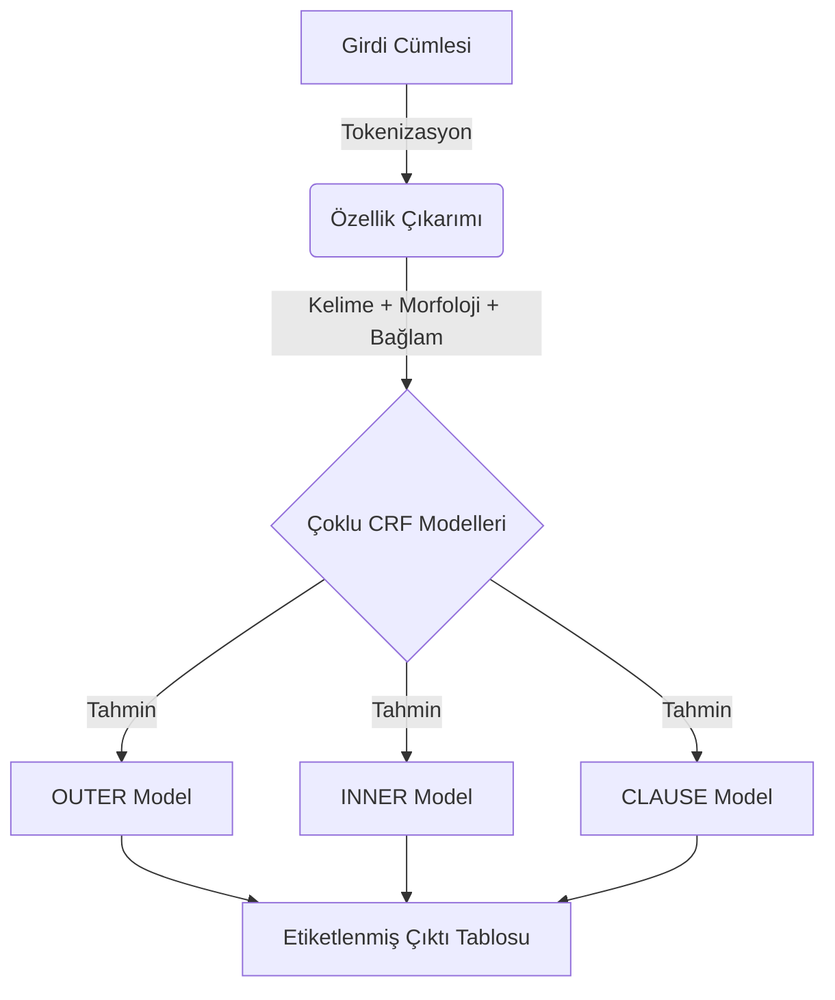

<div align="center">
  
# 🇹🇷 Türkçe İç İçe Öbekleme (Nested Chunking)

[](https://www.python.org/)
[]()
[]()
[]()

*Doğal Dil İşleme Dersi Projesi*

</div>

Bu proje, Türkçe metinler için hiyerarşik bir öbekleme (chunking) sistemi sunar. Koşullu Rastgele Alanlar (Conditional Random Fields - CRF) modelini kullanarak cümlelerdeki iç içe geçmiş sözdizimsel yapıları üç farklı seviyede analiz eder: `OUTER`, `INNER`, ve `CLAUSE`.

## 📖 Proje Hakkında

Proje, Türkçe cümlelerdeki temel sözdizimsel birimleri (öbekleri) otomatik olarak tanımak üzere tasarlanmıştır. Geleneksel düz öbeklemenin aksine, bu sistem iç içe geçmiş yapıları da (örneğin, bir isim öbeğinin içindeki sıfat-fiil grubu) tanıyabilir. Analiz, üç ayrı CRF modeli tarafından gerçekleştirilir:

1. **OUTER Chunk Modeli:** Cümledeki ana öbekleri (NP, VP, ADVP vb.) B-I-O formatında etiketler.
2. **INNER Chunk Modeli:** `OUTER` öbeklerin içinde yer alan daha küçük veya iç içe geçmiş öbekleri (örn. sıfat-fiil grupları) etiketler.
3. **CLAUSE Modeli:** Yan tümceleri (Relative Clause, Complement Clause) tanır.

## ✨ Özellikler

- **Model**: `sklearn-crfsuite` kütüphanesi ile geliştirilmiş Koşullu Rastgele Alanlar (CRF).
- **Hiyerarşik Analiz**: İç içe geçmiş dilbilgisi yapılarını tanımak için üç seviyeli öbekleme.
- **Veri Formatı**: Eğitim ve test verileri için standart `CoNLL` formatı kullanılır.
- **Zengin Öznitelik Seti**: Kelime kökleri, son ekler, bağlam bilgileri ve morfolojik ipuçlarını içeren gelişmiş öznitelikler kullanılır.
- **Detaylı Değerlendirme**: Her model için F1-skoru, kesinlik (precision), duyarlılık (recall) gibi metrikler hesaplanır ve karmaşıklık matrisleri (confusion matrix) oluşturulur.

---

## 🏗 Sistem Mimarisi



---

## 📂 Dosya Yapısı

```text
TurkishChunking/
├── data/
│   ├── train.conll        # Eğitim verisi
│   └── test.conll         # Test verisi
├── models/
│   ├── OUTER_model.pkl    # Dış öbekler için eğitilmiş model
│   ├── INNER_model.pkl    # İç öbekler için eğitilmiş model
│   └── CLAUSE_model.pkl   # Yan tümceler için eğitilmiş model
├── results/
│   ├── metrics_*.csv      # Her model için performans metrikleri
│   └── cm_*.png           # Her model için karmaşıklık matrisi grafikleri
├── src/
│   ├── features.py        # Öznitelik çıkarma fonksiyonları
│   ├── trainer.py         # Model eğitim ve tahmin sınıfları
│   └── evaluator.py       # Değerlendirme ve sonuç görselleştirme
└── main.py                # Ana betik (eğitim, test ve tahmin işlemleri)
```

---

## 🚀 Kurulum

Projeyi çalıştırmak için gerekli Python kütüphanelerini aşağıdaki komut ile yükleyebilirsiniz:

```bash
pip install sklearn-crfsuite joblib matplotlib seaborn scikit-learn pandas
```

---

## 💻 Kullanım

Proje, komut satırı arayüzü üzerinden üç farklı modda çalıştırılabilir: `train`, `test`, ve `predict`.

### 1. Modelleri Eğitme

Modelleri `data/train.conll` verisini kullanarak eğitmek ve `models/` dizinine kaydetmek için aşağıdaki komutu çalıştırın:

```bash
python main.py --mode train
```

### 2. Modelleri Test Etme

Eğitilmiş modelleri `data/test.conll` verisi üzerinde test etmek ve performans sonuçlarını (`metrics_*.csv` ve `cm_*.png`) `results/` dizinine kaydetmek için:

```bash
python main.py --mode test
```

Test işlemi tamamlandığında, örnek bir cümlenin analiz çıktısı ekranda gösterilir:

```text
--- Sample Prediction (First Sentence) ---
Dün             | Outer: B-ADVP      | Inner: _            | Clause: O
akşam           | Outer: I-ADVP      | Inner: _            | Clause: O
toplantıdan     | Outer: B-NP        | Inner: B-RELCL      | Clause: B-RELCL
erken           | Outer: I-NP        | Inner: I-RELCL      | Clause: I-RELCL
...
```

### 3. Yeni Bir Cümleyi Analiz Etme

Kendi cümlenizi analiz etmek için `predict` modunu kullanabilirsiniz. Model, verilen cümleyi anlık olarak etiketleyecektir.

```bash
python main.py --mode predict --sentence "Kütüphaneden aldığım kitabı üç günde bitirdim."
```

**Örnek Çıktı:**

```text
--- 'Kütüphaneden aldığım kitabı üç günde bitirdim.' Analizi ---
Kelime          | Dış Öbek   | İç Öbek    | Tümce Yapısı
------------------------------------------------------------
Kütüphaneden    | B-NP       | B-RELCL    | B-RELCL
aldığım         | I-NP       | I-RELCL    | I-RELCL
kitabı          | I-NP       | _          | O
üç              | B-ADVP     | _          | O
günde           | I-ADVP     | _          | O
bitirdim        | B-VP       | _          | O
.               | O          | _          | O
```

## Sonuçlar
Sonuçlar ve grafikler `results/` klasörü altında oluşturulur:
- `cm_OUTER.png`: Dış öbek karmaşıklık matrisi.
- `cm_INNER.png`: İç öbek karmaşıklık matrisi.
- `cm_CLAUSE.png`: Tümce yapısı karmaşıklık matrisi.
- `metrics_*.csv`: Performans metrikleri.
